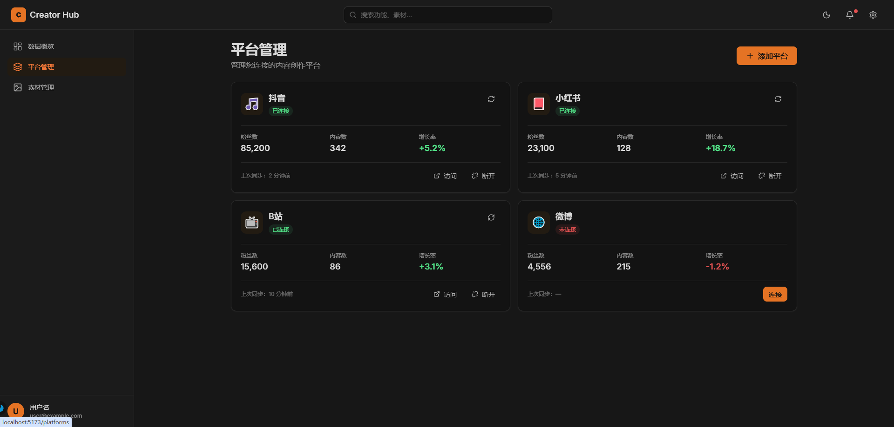
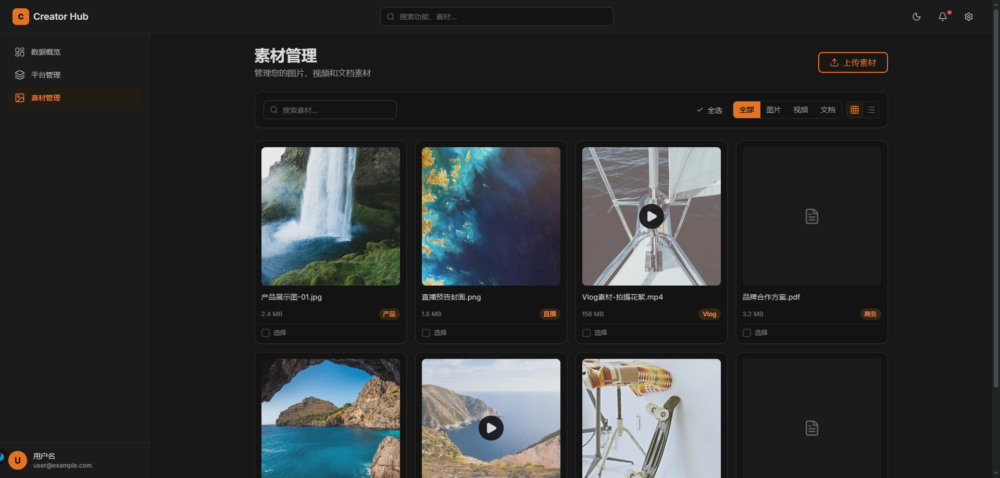
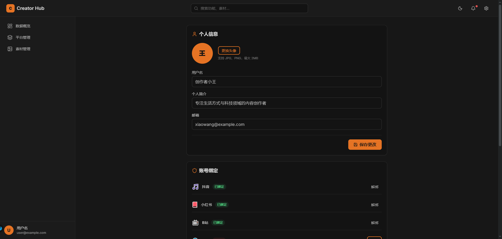
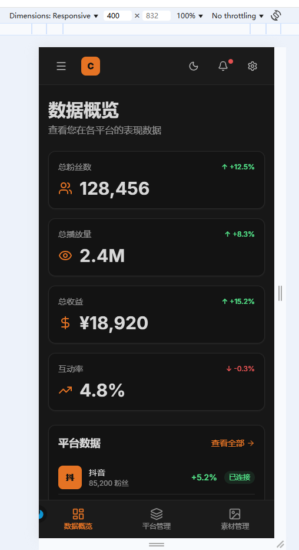
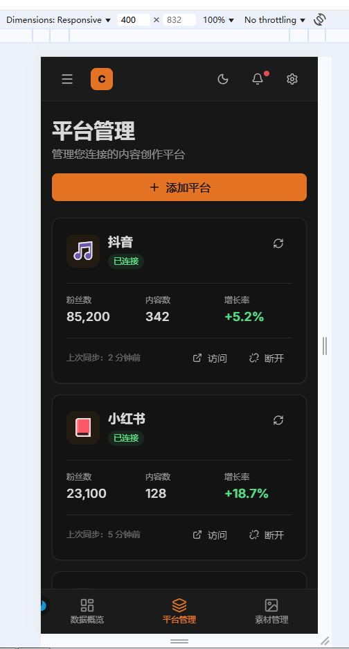
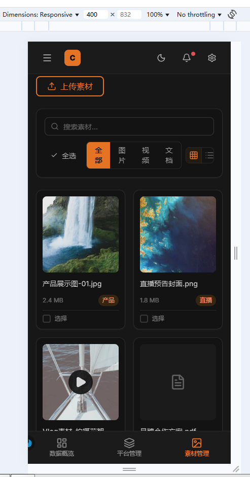
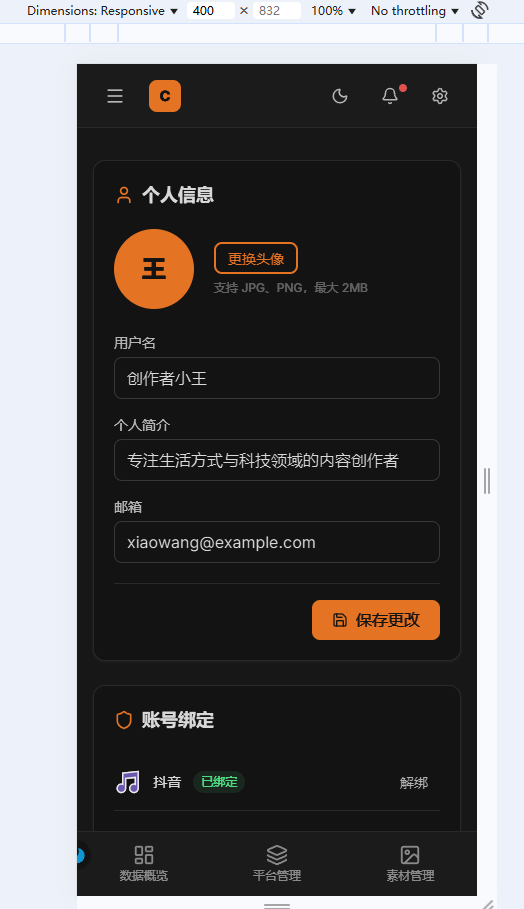

# Creator Hub

博主工具类 Web 应用，为内容创作者提供多平台管理、数据分析和素材管理能力。

## 技术栈

- **框架**：Svelte 5 + SvelteKit（Runes 模式）
- **样式**：Tailwind CSS v4
- **语言**：TypeScript
- **图标**：Lucide Icons
- **构建**：Vite 8

## 功能

- **数据概览** — 总粉丝、播放量、收益、互动率等核心指标，各平台数据对比
- **平台管理** — 抖音、小红书、B 站、微博等平台的连接/断开、数据同步
- **素材管理** — 图片/视频/文档的网格/列表视图，支持筛选、多选发布到指定平台，点击预览播放
- **设置** — 个人信息编辑、账号绑定、通知偏好、深色/浅色主题切换

## 快速开始

```bash
# 安装依赖
npm install

# 启动开发服务器
npm run dev

# 构建生产版本
npm run build

# 预览生产版本
npm run preview
```

## 项目结构

```
src/
├── app.css                          # Design Token + 全局样式
├── lib/
│   ├── components/ui/               # 可复用组件库
│   │   ├── Button.svelte
│   │   ├── Card.svelte
│   │   ├── Modal.svelte
│   │   ├── StatCard.svelte
│   │   └── ...
│   └── stores/theme.svelte.ts       # 主题状态管理
└── routes/
    ├── +layout.svelte               # 主布局（Header + Sidebar）
    ├── +page.svelte                 # 数据概览
    ├── platforms/+page.svelte       # 平台管理
    ├── media/+page.svelte           # 素材管理
    └── settings/+page.svelte        # 设置
```

## 页面预览

### 平台管理



### 素材管理



### 设置



### 移动端适配

| 数据概览 | 平台管理 | 素材管理 | 设置 |
|:---:|:---:|:---:|:---:|
|  |  |  |  |
